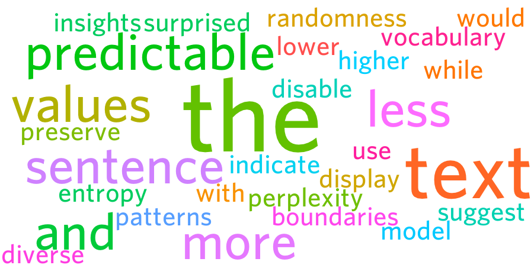

# Text-Gen-Ngram

A Rust-based text generator that uses N-gram models to generate text from scraped or local data.

## Features

- Train N-gram models on text from various sources
- Multiple built-in scrapers:
    - Basic web scraper (any URL with CSS selector)
    - Wikipedia article scraper (concurrent topic fetching)
    - Lyrics scraper (using Genius API)
- Asynchronous I/O operations
- Optimize models by deduplicating tokens
- Configurable tokenization options
- Interactive configuration with saved settings
- Seed text support for generation
- Intelligent text formatting for natural-looking output
- Automatic wordcloud generation from generated text
- Text insights and statistics for generated content
- Simple error handling and logging

## Installation

```bash
git clone https://github.com/giothun/text-gen-ngram.git
cd text-gen-ngram
cargo build --release
```

## Quick Start

```bash
# Train from a local file
cargo run -- --input-file path/to/text.txt

# Use Wikipedia scraper
cargo run -- --scraper-type wikipedia

# Use lyrics scraper (requires Genius API token)
cargo run -- --scraper-type lyrics

# Generate text with specific length
cargo run -- --input-file path/to/text.txt --length 100

# Generate text with seed text
cargo run -- --input-file path/to/text.txt --seed "Once upon a time"

# Generate text without wordcloud
cargo run -- --input-file path/to/text.txt --no-wordcloud

# Generate text without displaying text insights
cargo run -- --input-file path/to/text.txt --no-insights
```

## Command Line Options

- `--scraper-type` or `-t`: Scraper to use (basic, wikipedia, lyrics)
- `--scraper-config` or `-c`: Path to scraper config file
- `--ngram` or `-n`: N-gram size (default: 3)
- `--length` or `-l`: Number of tokens to generate (default: 50)
- `--input-file` or `-i`: Path to local text file
- `--seed`: Seed text for generation
- `--output-file` or `-o`: Path to save generated text
- `--optimize`: Optimize model by deduplicating tokens
- `--prune-min-occurrences`: Minimum occurrences for pruning
- `--show-stats`: Show model statistics
- `--no-wordcloud`: Disable wordcloud generation
- `--no-insights`: Disable displaying text insights
- `--verbose` or `-v`: Enable verbose logging

## Tokenization Options

- `--lowercase`: Convert text to lowercase (default: true)
- `--preserve-punctuation`: Keep punctuation as separate tokens (default: true)
- `--preserve-sentence-boundaries`: Maintain sentence structure (default: true)

## Text Insights

The application automatically analyzes the generated text and displays useful statistics and insights, including:

- Character and word counts
- Unique word count and percentage
- Estimated sentence count
- Average words per sentence
- Most common words with frequency analysis
- Vocabulary richness (Type-Token Ratio)
- Average word length
- Shannon entropy (bits) - measures the unpredictability of the text
- Perplexity - indicates how "surprised" the model would be by the text

Lower entropy and perplexity values indicate more predictable text with less randomness, while higher values suggest
more diverse vocabulary and less predictable patterns.

To disable the display of text insights, use the `--no-insights` flag.

## Text Formatting

The application includes intelligent text formatting to ensure the generated output is readable and natural. The
formatting engine handles:

- Proper sentence capitalization and punctuation
- Correct handling of contractions (e.g., "don't", "I'm", "you're")
- Appropriate spacing around punctuation marks
- Formatting of section headers (for Wikipedia-style content)
- Preservation of paragraph structure
- Proper handling of quotation marks and parentheses

This ensures that the generated text maintains a natural flow and readability, regardless of the source material or
n-gram size used for training.

## Wordcloud Generation

The application automatically generates a wordcloud visualization from the generated text. The wordcloud highlights the
most frequently occurring words, with larger font sizes indicating higher frequency. The wordcloud is saved as a PNG
file with a timestamp in the filename (e.g., `wordcloud_20250312231753.png`).

The wordcloud generation process runs silently in the background, with only essential information logged to the console.
This ensures a clean output experience focused on the text generation results.

To disable wordcloud generation, use the `--no-wordcloud` flag.

## Scraper Configuration

Each scraper can be configured with:

- **Request timeout**: Set maximum time for HTTP requests
- **Scraper-specific settings**:
    - Basic: URL and CSS selector (defaults to "body" if none provided)
    - Wikipedia: List of topics
    - Lyrics: Genius API token, artist names, and songs per artist

## Creating Custom Scrapers

Implement the `Scraper` trait:

```rust
#[async_trait]
impl Scraper for MyCustomScraper {
    async fn fetch_text(&self) -> Result<String> {
        // Your implementation here
    }
}
```

## Result for this README.md file
```
📊 Text Insights 📊
-----------------
• Total characters: 316
• Total words: 44
• Unique words: 33 (75.0% of total)
• Estimated sentences: 3
• Average words per sentence: 14.7
• Most common words:
1. "the" (appears 4 times, 9.1%)
2. "text" (appears 3 times, 6.8%)
3. "and" (appears 2 times, 4.5%)
4. "predictable" (appears 2 times, 4.5%)
5. "more" (appears 2 times, 4.5%)
   • Vocabulary richness (TTR): 0.750
   • Average word length: 5.8 characters
   • Shannon entropy: 4.897 bits
   • Perplexity: 29.79
   (Lower entropy/perplexity = more predictable text)
```



## License

MIT
